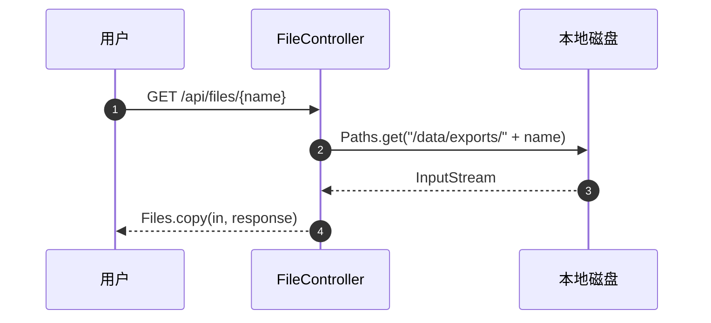

<!--
单接口产物（endpoint-*.md）的格式参考。可被被分析项目内的同名文件覆盖。

每个 subagent 撰写自身的 endpoint-*.md 时，将下文 `#### {METHOD} {URL}` 一节的
标题升级为顶层 `# {METHOD} {URL} — 一句话功能`，正文格式照搬。本文件的顶层
"业务流讲解" / "整体在做什么" / "子功能 N" 等结构面向 aggregator（overview.md /
features.md）使用——单接口产物文件不包含此类外层包装。
-->

# {范围名} 业务流讲解

## 整体在做什么

80-200 字段落形式叙述：本范围内代码的功能、触发者、关键流程的串接关系。

## 业务流

### 子功能 1：文件管理

#### GET /api/files/{name}

已登录用户下载导出文件（com.acme.file.FileController#download，FileController.java:29）。入参直接拼接至后端路径，流程简单：

- **请求**：path `name` (string)
- **输入流向**：`path.name` → `Paths.get("/data/exports/" + name)` → `Files.copy(path, OutputStream)`（FileController.java:34）—— 拼接到路径
- **文件**：读取 `/data/exports/{path.name}`（按用户传入文件名读取并写入响应流）

#### POST /api/jobs/run-report

管理员触发离线对账（com.acme.ops.JobController#runReport，JobController.java:73）。顺序执行流程：

1. `ProcessBuilder` 执行 `scripts/run-report.sh`
2. 脚本运行 `spark-submit jobs/report.jar`（数据源 PostgreSQL `bills.txn_*`）
3. 作业将 CSV 写入 `/data/reports/{date}/`，随后 `awscli sync` 至 `s3://acme-reports/`
4. 脚本退出码作为接口返回；不记业务日志

#### GET /api/users/me

已登录用户读取自身资料（com.acme.user.UserController#me，UserController.java:18）。

## 未能追溯的引用

仅在存在未能定位的下游目标时撰写本节，按 `<引用> — 调用点 (文件:行号)` 一条一行；无则**略去整节**。

- `http://internal-billing/charge` — com.acme.pay.PayClient#charge（PayClient.java:31）
