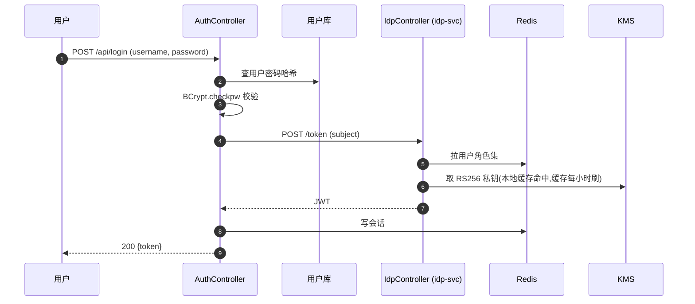

<!--
biz-flow-recon 默认输出模板（粒度 B：子功能 + 接口）。
本文件可被被分析项目里的 `biz-flow-recon/templates/default.md` 覆盖。
读完照样写一份给当前分析对象。

要点：
- **清晰优先，不拘形式**——按流程特点挑：图 / 编号步骤 / labeled 短列表 / 几句话 / 一行话。
- 不要机械套字段（每条都 `- 入口:` `- 触发者:` 那种叫机械填表，禁止）。
- 没发生的事实不写（"外部命令: 无"禁止）。
- 段落里嵌入 (类#方法，文件:行号) 作为定位锚点。
- 不评判风险，只描述事实。
- 找不到的下钻目标必须点名 + 在末尾"未跟到的引用"列出。
-->

# {范围名} 业务流讲解

## 整体在做什么

80-200 字讲清这个范围内的代码在做什么、由谁触发、关键流程怎么串。这一段保持成段叙述（不要 bullet）。

## 业务流

### 子功能 1：用户登录与会话

#### POST /api/login

未登录用户的登录入口（com.acme.auth.AuthController#login，AuthController.java:42）。涉及多服务跨调用，画图最清楚：

关键事实补充：
- **加解密**：`BCrypt.checkpw` 校验密码哈希——避免明文比对；`IdpController#issue`（services/idp-svc/.../IdpController.java:25）用 RS256 签 JWT，私钥由 `IdpKmsClient`（IdpKmsClient.java:18）启动时从 KMS 拉到本地缓存
- **配置文件**：启动读 `config/oauth.yaml`（YAML，OAuth 客户端配置）
- **日志**：每次登录尝试写一行 Logback 到 `/var/log/acme/auth.log`

代码位置：`src/main/java/com/acme/auth/`、`services/idp-svc/`。

#### POST /api/jobs/run-report

管理员触发离线对账（com.acme.ops.JobController#runReport，JobController.java:73）。流程是顺序的，列编号步骤：

1. 用 `ProcessBuilder` 执行 `scripts/run-report.sh`
2. 脚本里 `spark-submit` 一个打包在 `jobs/report.jar` 的作业，数据源是 PostgreSQL `bills` 库的 `txn_*` 分区表
3. 作业把 CSV 写到 `/data/reports/{date}/`
4. 用 `awscli sync` 同步到 `s3://acme-reports/`
5. 脚本退出码作为接口返回；不记业务日志

代码位置：`src/main/java/com/acme/ops/`、`scripts/run-report.sh`。

#### GET /api/users/me

已登录用户读取自己的资料（com.acme.user.UserController#me，UserController.java:18，代码在 `src/main/java/com/acme/user/`）。

### 子功能 2：订单管理

#### POST /api/orders

...（按这条流程的特点挑形式）

## 未跟到的引用

仅当存在未在工作区找到的下钻目标时才写这一节，按 `<引用> — 调用点 (文件:行号)` 一条一行；没有就**整节略掉**。

- `scripts/legacy-import.py` — 调用点 com.acme.imp.ImportRunner#run（ImportRunner.java:54）
- `http://internal-billing/charge` — 调用点 com.acme.pay.PayClient#charge（PayClient.java:31），未在工作区找到对应服务
