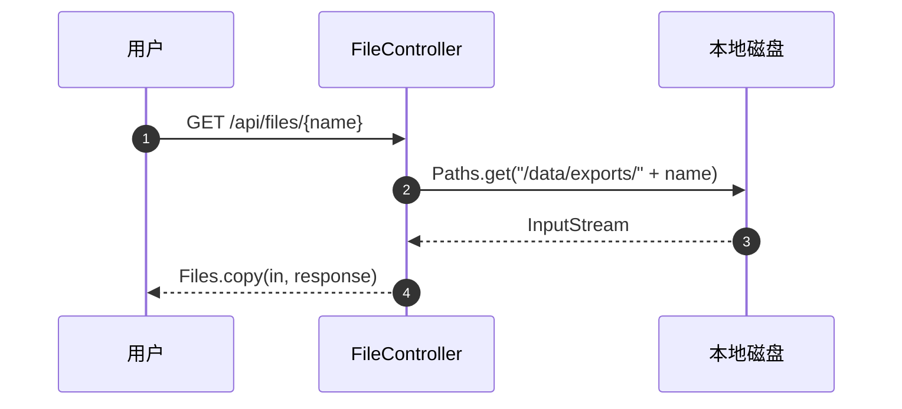

<!--
默认输出模板。可被项目里同名文件覆盖。
- 粒度 B：用整份骨架（顶层叙述 + 子功能分组 + 接口块）。
- 粒度 C：只取一个接口块，把 `#### POST /api/...` 提到顶层 `# POST /api/... — 一句话功能`。
-->

# {范围名} 业务流讲解

## 整体在做什么

80-200 字成段叙述：这个范围的代码做什么、谁触发、关键流程怎么串。

## 业务流

### 子功能 1：文件管理

#### GET /api/files/{name}

已登录用户下载导出文件（com.acme.file.FileController#download，FileController.java:29）。入参直接拼到后台路径，简单流程：

- **请求**：path `name` (string)
- **输入流向**：`path.name` → `Paths.get("/data/exports/" + name)` → `Files.copy(path, OutputStream)`（FileController.java:34）—— 拼路径
- **文件**：读 `/data/exports/{path.name}`（按用户传入文件名读取并写到响应流）

#### POST /api/jobs/run-report

管理员触发离线对账（com.acme.ops.JobController#runReport，JobController.java:73）。顺序流程：

1. `ProcessBuilder` 执行 `scripts/run-report.sh`
2. 脚本 `spark-submit jobs/report.jar`（数据源 PostgreSQL `bills.txn_*`）
3. 作业把 CSV 写到 `/data/reports/{date}/`，再 `awscli sync` 到 `s3://acme-reports/`
4. 脚本退出码作为接口返回；不记业务日志

#### GET /api/users/me

已登录用户读取自己的资料（com.acme.user.UserController#me，UserController.java:18）。

## 未跟到的引用

仅在存在未找到的下钻目标时写这一节，按 `<引用> — 调用点 (文件:行号)` 一条一行；没有就**整节略掉**。

- `http://internal-billing/charge` — com.acme.pay.PayClient#charge（PayClient.java:31）
