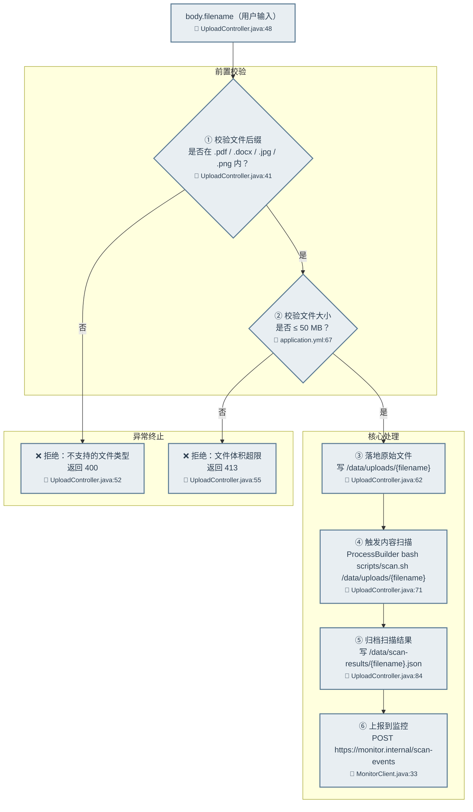

<!--
单接口产物（endpoint-*.md）的格式参考。可被被分析项目内的同名文件覆盖。

每个 subagent 撰写自身的 endpoint-*.md 时，将下文 `#### {METHOD} {URL}` 一节的
标题升级为顶层 `# {METHOD} {URL} — 一句话功能`，正文格式照搬。本文件的顶层
"业务流讲解" / "整体在做什么" / "子功能 N" 等结构面向 aggregator（overview.md /
features.md）使用——单接口产物文件不包含此类外层包装。
-->

# {范围名} 业务流讲解

## 整体在做什么

80-200 字段落形式叙述：本范围内代码的功能、触发者、关键流程的串接关系。

## 业务流

### 子功能 1：文件管理

#### POST /api/files/upload

用户向系统提交一份业务文件（合同、表单、附件等）进行存档（com.acme.file.UploadController#upload，UploadController.java:48）。处理流程分为**前置校验 → 核心处理 → 异常终止**三组：先校验文件后缀与大小，通过后落地原始文件、触发扫描、归档结果、上报监控；任一校验失败直接返回 4xx。

- **请求**：multipart/form-data，含 `file`（binary，原始内容）+ form 字段 `filename` (string!)
- **输入流向**：
  - `body.filename` → `Paths.get("/data/uploads/" + filename)` → `Files.write`（UploadController.java:62）—— 拼接到路径
  - `body.filename` → `ProcessBuilder("bash", "scripts/scan.sh", "/data/uploads/" + filename)`（UploadController.java:71）—— 拼接到命令
  - `body.filename` → `Paths.get("/data/scan-results/" + filename + ".json")` → `Files.write`（UploadController.java:84）—— 拼接到路径
- **关键控制点**：
  - TLS 证书校验：关闭（OkHttp 自定义 trustAll `X509TrustManager` + `HostnameVerifier` 恒返回 true，MonitorClient.java:18）（开关）
  - 文件后缀白名单：`.pdf` / `.docx` / `.jpg` / `.png`（UploadController.java:41）（判断）
  - 上传大小限制：50 MB（`spring.servlet.multipart.max-file-size`，application.yml:67）（限制）
  - 扫描脚本路径：硬编码 `scripts/scan.sh`，未读环境变量或配置（UploadController.java:71）（配置）
- **文件**：写入 `/data/uploads/{body.filename}`（用户传入文件名，原始上传内容落盘）；写入 `/data/scan-results/{body.filename}.json`（JSON，扫描结果）
- **命令**：`ProcessBuilder` 执行 `bash scripts/scan.sh /data/uploads/{body.filename}`（UploadController.java:71）
- **第三方**（监控上报）：`POST https://monitor.internal/scan-events`，Content-Type `application/json`，body `{filename, scanResultPath, status}`；客户端 OkHttp（com.acme.monitor.MonitorClient，MonitorClient.java:33）

## 未能追溯的引用

仅在存在未能定位的下游目标时撰写本节，按 `<引用> — 调用点 (文件:行号)` 一条一行；无则**略去整节**。

- `scripts/scan.sh` — 调用点 com.acme.file.UploadController#upload（UploadController.java:71），未在工作区找到该脚本
