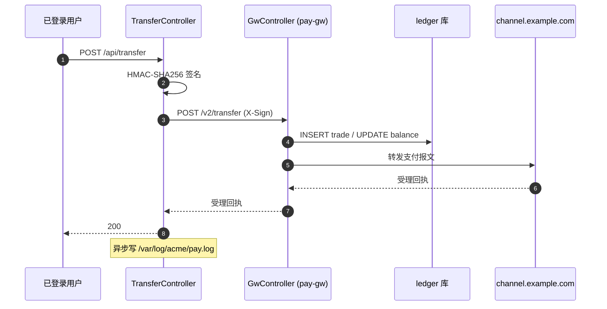

<!-- 单接口模板（粒度 C）。可被项目里同名文件覆盖。 -->

# POST /api/transfer — 跨账户转账

已登录用户发起跨账户转账（com.acme.pay.TransferController#transfer，TransferController.java:58）。流程跨多服务，画图最清楚：



- **请求**：body JSON

  ```json5
  {
    "fromAccount": "string!",   // @NotBlank，账号 18 位
    "toAccount":   "string!",   // @NotBlank
    "amount":      "decimal!",  // >0，最多 2 位小数
    "orderId":     "string!",   // 业务幂等键，@Pattern("[A-Z0-9]{16}")
    "memo":        "string?"    // 可选，<=64
  }
  ```

  DTO: com.acme.pay.TransferRequest（TransferRequest.java:14）；Header `Authorization: Bearer <jwt>`、`Content-Type: application/json`
- **第三方（内部网关）**：调 `http://internal-pay/v2/transfer`，POST `application/json`，Header `X-Sign: <hex>`，body 与上面一致；客户端 OkHttp（PayClient.java:71）。对端 com.acme.pay.gw.GwController#transfer（services/pay-gw/.../GwController.java:39）
- **第三方（外部通道）**：网关把请求转发到 `https://channel.example.com`
- **加解密**：`HMAC-SHA256` 签外呼报文——避免支付通道篡改
- **数据库**：网关用 MyBatis `mapper/TransferMapper.xml` 在 `ledger` 表 INSERT trade / UPDATE balance
- **日志**：异步追加一行到 `/var/log/acme/pay.log`

## 未跟到的引用

仅在存在未找到的下钻目标时写这一节；没有就**整节略掉**。
