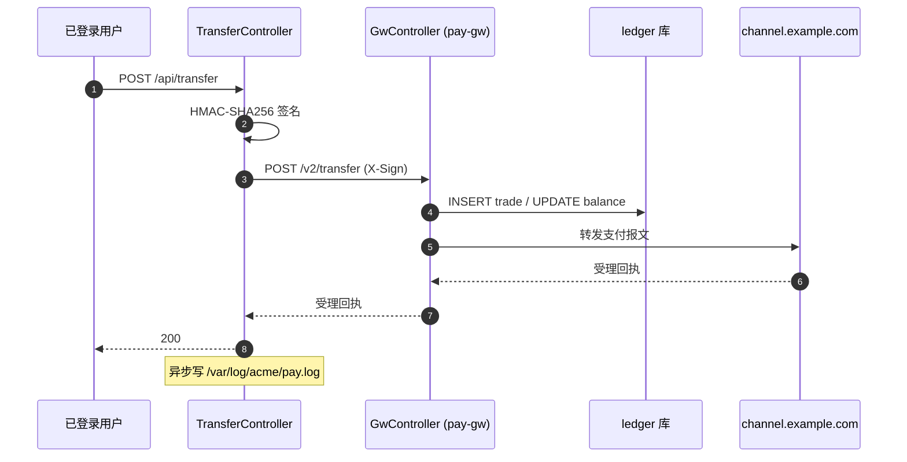

<!--
biz-flow-recon 输出模板（粒度 C：单接口）。
本文件可被被分析项目里的 `biz-flow-recon/templates/endpoint.md` 覆盖。
仅当用户给了具体 URL 或类#方法名时使用。
-->

# {METHOD} {URL} — {一句话功能}

{1-3 段散文，把这个接口讲清楚：}

已登录用户发起跨账户转账（com.acme.pay.TransferController#transfer，
TransferController.java:58）。请求落库前先用 HMAC-SHA256 签外呼报文——
避免支付通道篡改；随后调用内部支付网关 http://internal-pay/v2/transfer
（POST application/json，Header X-Sign: <hex>，body 含金额、账户、订单号），
客户端是 OkHttp（PayClient.java:71）。**对端实现 com.acme.pay.gw.GwController#transfer
（services/pay-gw/.../GwController.java:39）那边把请求落到 ledger 表（MyBatis
mapper/TransferMapper.xml 里 INSERT trade、UPDATE balance），并向真正外部支付
通道 https://channel.example.com 转发**。回执写库后异步往 /var/log/acme/pay.log
追加一行交易记录。代码在 src/main/java/com/acme/pay/。

## 未跟到的引用

仅当存在未在工作区找到的下钻目标时才写这一节；没有就**整节略掉**。
