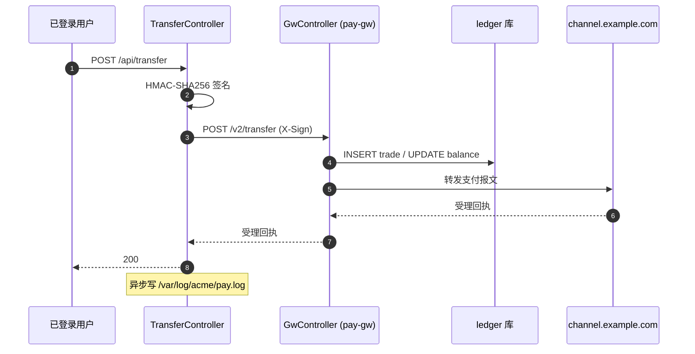

<!-- 单接口模板（粒度 C）。可被项目里同名文件覆盖。 -->

# POST /api/transfer — 跨账户转账

已登录用户发起跨账户转账（com.acme.pay.TransferController#transfer，TransferController.java:58）。流程跨多服务，画图最清楚：



- **请求**：body JSON

  ```json5
  {
    "fromAccount": "string!",   // @NotBlank，账号 18 位
    "toAccount":   "string!",   // @NotBlank
    "amount":      "decimal!",  // >0，最多 2 位小数
    "orderId":     "string!",   // 业务幂等键，@Pattern("[A-Z0-9]{16}")
    "memo":        "string?"    // 可选，<=64
  }
  ```

  DTO: com.acme.pay.TransferRequest（TransferRequest.java:14）；Header `Authorization: Bearer <jwt>`、`Content-Type: application/json`
- **第三方（内部网关）**：

  ```
  POST http://internal-pay/v2/transfer
  - Content-Type: application/json
  - X-Sign: HMAC-SHA256(body, key=PAY_HMAC_SECRET)
  - body: 同上 TransferRequest（fromAccount/toAccount/amount/orderId/memo）
  - 客户端: OkHttp（com.acme.pay.PayClient#transfer，PayClient.java:71）
  ```

  对端 com.acme.pay.gw.GwController#transfer（services/pay-gw/.../GwController.java:39）：写 ledger 后再转发到外部通道
- **第三方（外部通道）**：

  ```
  POST https://channel.example.com/v3/transfer
  - Content-Type: application/json
  - Authorization: Basic <base64(channel_id:secret)>
  - body: {accountFrom, accountTo, amount, refId={orderId}}
  - 客户端: OkHttp（services/pay-gw/.../ChannelClient.java:24）
  ```
- **加解密**：`HMAC-SHA256` 签内部网关请求体（避免支付通道篡改）；外部通道用 Basic Auth
- **文件**（网关侧）：MyBatis `mapper/TransferMapper.xml` 对 `ledger` 表 INSERT trade、UPDATE balance（services/pay-gw/.../TransferMapper.xml:18）
- **文件**：异步追加一行到 `/var/log/acme/pay.log`（Logback 行日志，每笔交易一行）

## 未跟到的引用

仅在存在未找到的下钻目标时写这一节；没有就**整节略掉**。
